-   [Description](#description)
-   [Installation](#installation)
-   [Execution](#execution)
-   [Quick guide to get started](#quick-guide-to-get-started)
    -   [PDE\_analyzer\_i()](#pde_analyzer_i)
    -   [PDE\_reader\_i()](#pde_reader_i)
-   [Parameters](#parameters)
    -   [PDE\_analyzer\_i()](#pde_analyzer_i-1)
    -   [PDE\_reader\_i()](#pde_reader_i-1)
-   [Troubleshoot](#troubleshoot)
    -   [Error when starting interactive user interface on Mac (failed
        to allocate tcl
        font)](#error-when-starting-interactive-user-interface-on-mac-failed-to-allocate-tcl-font)
-   [Example](#example)
    -   [Process Methotrexate articles with the
        PDE\_analyzer\_i()](#process-methotrexate-articles-with-the-pde_analyzer_i)
    -   [Visualize extracted Methotrexate data with the
        PDE\_reader\_i()](#visualize-extracted-methotrexate-data-with-the-pde_reader_i)

------------------------------------------------------------------------

Description
-----------

PDE is a R package that easily extracts information and tables from PDF
files. The `PDE_analyzer_i()` performs the sentence and table extraction
while the included `PDE_reader_i()` allows the user-friendly
visualization and quick-processing of the obtained results.

------------------------------------------------------------------------

Installation
------------

Install the dependent packages

    install.packages("tcltk2")    # Install the dependent package tcltk2

The package requires the Xpdf command line tools by Glyph & Cog, LLC.
Please download and install the Xpdf command line tools from the
following website onto your local disk:
<a href="https://www.xpdfreader.com/download.html" class="uri">https://www.xpdfreader.com/download.html</a>
(<a href="https://www.xpdfreader.com/download.html" class="uri">https://www.xpdfreader.com/download.html</a>).
Alternatively, the following command can be used to install the correct
Xpdf command line tools:

    PDE_install_Xpdftools4.02()    # Download and install the Xpdf command line tools
    PDE_check_Xpdf_install()        # Check if all required XPDF tools are installed correctly

Install the package through CRAN

    install.packages("PDE", dependencies = TRUE)

or choose the location where you downloaded latest PDE\_\*.\*.\*.tar.gz
and install it from a local path.

    filename <- file.choose()     # Choose the location where you downloaded the latest PDE_*.*.*.tar.gz
    install.packages(filename,  type="source", repos=NULL)

**NOTE: The PDE package was tested on Microsoft Windows, Mac and Linux
machines. Major differences include the visual appearance of the
interfaces and the directory structures, but all functions are
preserved.**

------------------------------------------------------------------------

Execution
---------

The PDE analyzer can be accessed through different functions which are
outlined below.

    PDE_analyzer()
    PDE_analyzer_i()
    PDE_extr_data_from_pdfs()
    PDE_pdfs2table()
    PDE_pdfs2table_searchandfilter()
    PDE_pdfs2txt_searchandfilter()

The PDE reader is only available as an interactive user interface
requiring the R package **tcltk2**.

    PDE_reader_i()

**NOTE: For problem solution concerning a potential error when starting
`PDE_analyzer_i()` or `PDE_reader_i()` on Mac see
[Troubleshoot](#troubleshoot) - [Error when starting interactive user
interface on Mac (failed to allocate tcl
font)](#error-when-starting-interactive-user-interface-on-mac-failed-to-allocate-tcl-font).**

Quick guide to get started
--------------------------

### PDE\_analyzer\_i()

1.  Run

<!-- -->

    library("PDE")
    PDE_analyzer_i()

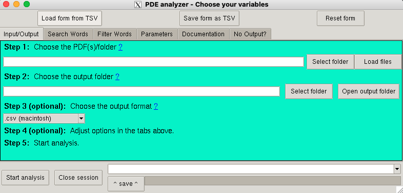

`PDE_analyzer_i()` user interface on Mac

 

1.  This should open a user interface.
2.  Fill out the form from top to bottom (standard parameters are
    preselected).  
3.  The filled form can and should be saved as a TSV file at any time.
    This can be done by clicking the **Save form as tsv** button at the
    top, center of the form.  
    **NOTE: Choose an empty folder or create a new one as the output
    directory, since analyses create at least a number of files equal to
    the number of PDF files analyzed.**

------------------------------------------------------------------------

### PDE\_reader\_i()

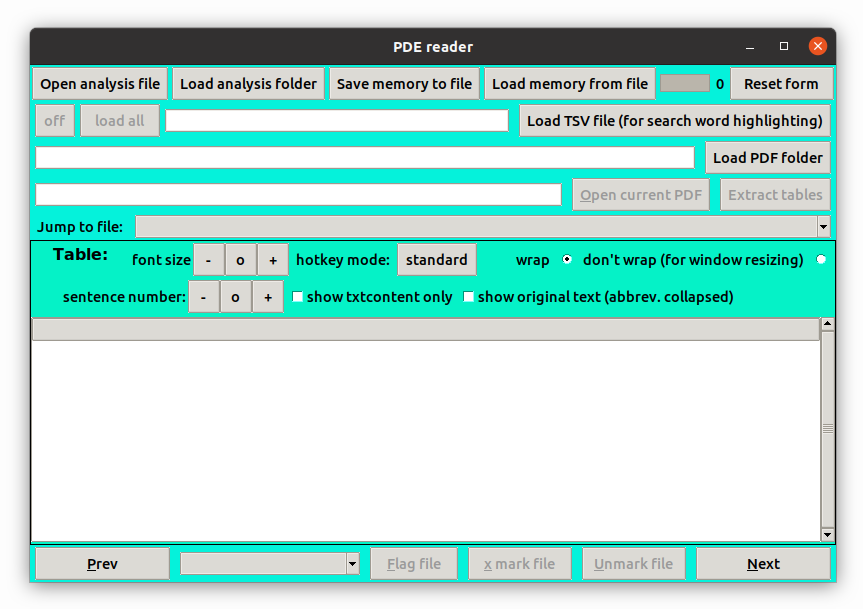

`PDE_reader_i()` user interface on Linux

 

1.  Run

<!-- -->

    library("PDE")
    PDE_reader_i()

1.  This should open a user interface.

2.  Load either a sentence analysis file or a folder with such files.  
    **NOTE: Analysis files refer to the files created by the
    PDE\_analyzer\_i() which contain “txt+-” in their name.**

3.  The user can browse through all analysis files in the folder to get
    an overview over the data.

4.  Additional functions can be enabled by loading the PDF folder as
    well as the TSV file used for analysis.  
    **NOTE: Flagging and marking changes filenames but can be reversed
    in the program at any time.**

------------------------------------------------------------------------

Parameters
----------

### PDE\_analyzer\_i()

**NOTE: Arguments for the R function `PDE_extr_data_from_pdfs()` are
listed below each description:** `argument`

1.  Run

<!-- -->

    library("PDE")
    PDE_analyzer_i()

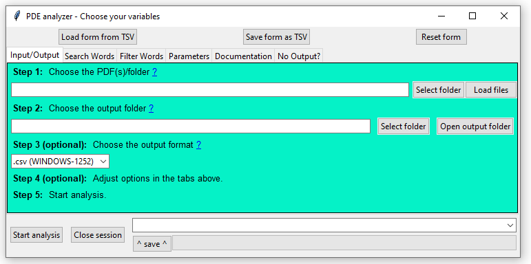

`PDE_analyzer_i()` user interface on Microsoft Windows

 

#### Choose the locations for the required files:

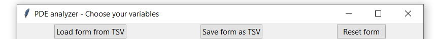

`PDE_analyzer_i()` user interface - Choose the locations for the
required files

 

1.  **Load form from tsv** OR **Save form as tsv**: The filled form can
    and should be saved as a TSV file at any time, accordingly the saved
    parameters can be loaded from saved TSV files.

2.  **Reset form**: This will clear all fields and variables.

#### Input/Output:

`PDE_analyzer_i()` user interface - Input/Output

 

1.  **Open PDF folder**: Open a folder with PDF files you want to
    analyze. For the analysis, all PDF files in the folder and
    subfolders will be analyzed.  
    or  
    **Load PDF files**: Select one or more PDF files you want to analyze
    (use Ctrl and/or Shift to select multiple). Multiple PDF files will
    be separated by ; without a space.  
    Argument for `PDE_extr_data_from_pdfs()`: `pdfs`

2.  **Choose what to extract**: The PDE analyzer has 2 main functions
    A\] PDF2TXT (extract sentences from pdf) and B\] PDF2TABLE (table of
    PDF to excel file) which can be combined or executed separately.
    Each function can be combined with filters and search words. A file
    with the sentences carrying the search words will have the name
    format: `[search words]txt+-[context][PDF file name]` in the
    corresponding subfolder. Tables will be named:
    `[PDF file name][number of table][table heading]`.  
    Argument for `PDE_extr_data_from_pdfs()`: `whattoextr`

3.  **Open output folder**: All analysis files will be created inside of
    this folder; therefore, choose an empty folder or create a new one
    as output directory, since analyses create at least a number of
    files equal to the amount of PDF files analyzed. If no output folder
    is chosen, the results will be saved in the R working directory.  
    Argument for `PDE_extr_data_from_pdfs()`: `out`

4.  **Choose output format**: The resulting analyses files can either be
    generated as comma-separated values files (.csv) or tab-separated
    values files (.tsv), with the former being easier to open and save
    in Microsoft Excel, while the later leads to less errors when
    opening in Microsoft Excel (as tabs are rare in texts). Depending on
    the operational system the output file are opened in, it is
    recommended to choose the Microsoft Windows (WINDOWS-1252), Mac
    (macintosh) or Linux (UTF-8) encoding.  
    Argument for `PDE_extr_data_from_pdfs()`: `out.table.format`

#### Parameters:

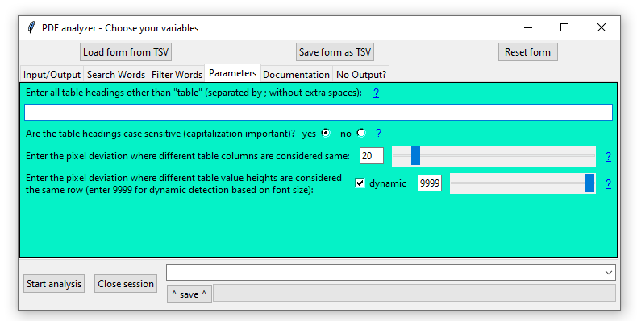

`PDE_analyzer_i()` user interface - Parameters

 

1.  **Enter table headings**: Standard scientific articles have their
    tables labeled with “TABLE”, “TAB”, “Table” or “table” plus number
    and are detected accordingly. If a table is expected to have a
    different heading, it should be typed in this field. For multiple
    different heading use “;” without extra spaces.  
    Argument for `PDE_extr_data_from_pdfs()`: `table.heading.words`

2.  **Table heading case sensitive**: E.g., for “HEADING”, if “no” was
    chosen then “HEADING”, “heading”, “Heading”, etc., will be detected,
    if “yes” was chosen only “HEADING” will be detected.  
    Argument for `PDE_extr_data_from_pdfs()`: `ignore.case.th`

3.  **Pixel deviation**: For some tables the heading is slightly
    indented which would make the algorithm assume it was a separated
    column. With the pixel deviation the size of indention which would
    be considered the same column can be adjusted.  
    Argument for `PDE_extr_data_from_pdfs()`: `dev`

4.  **Filter words?**: In some cases, only articles of a certain topic
    should be analyzed. Filterwords provide a way to analyze only
    articles which carry words from a list at least n times.

5.  **Filter words**: Type in the list of filter words separated by “;”
    without spaces in between. A hit will be counted every time a word
    from the list is detected in the article.  
    Argument for `PDE_extr_data_from_pdfs()`: `filter.words`

6.  **Filter words case sensitive**: E.g., for “Word”, if “no” was
    chosen then “word”, “WORD”, “Word”, etc., will be detected, if “yes”
    was chosen only “Word” will be detected.  
    Argument for `PDE_extr_data_from_pdfs()`: `ignore.case.fw`

7.  **Filter word times**: This represents the minimum number of hits
    described above which has to be detected for a paper to be further
    analyzed. If the threshold is not met, a documentation file can be
    exported if selected in the documentation section.  
    Argument for `PDE_extr_data_from_pdfs()`: `filter.word.times`

8.  **Search words?**: The algorithm can either extract , tables, or
    sentences and tables with one of the search words present. If the
    “tables” only analysis was chosen, the algorithm can also extract
    all tables detected in the paper (choose this option here). In the
    later case, the search words field should remain empty.

9.  **Search words**: Type in the list of search words separated by “;”
    without spaces in between.  
    Argument for `PDE_extr_data_from_pdfs()`: `search.words`

10. **Search words case sensitive**: E.g., for “Word”, if “no” was
    chosen then “word”, “WORD”, “Word”, etc., will be detected, if “yes”
    was chosen only “Word” will be detected.  
    Argument for `PDE_extr_data_from_pdfs()`: `ignore.case.sw`

11. **Number of sentences before and after**: When 0 is chosen, only the
    sentence with the search word is extracted. If any number n is
    chosen, n number of sentences before and n number of sentences after
    the sentence with the search word will be extracted. A sentence is
    currently defined by starting and ending with a “.” (period with a
    subsequent space).  
    Argument for `PDE_extr_data_from_pdfs()`: `context`

12. **Evaluate abbreviations?**: If “yes” was chosen, all abbreviations
    that were used in the PDF documents for the search words will be
    saved and then replace by `abbreviation (search word)$*`, e.g.,
    `MTX` will be replaced by `MTX (Methotrexate)$*`. In addition plural
    of the abbreviations, i.e., the abbreviation with an “s” at the end
    will be replaced accordingly as well.  
    Argument for `PDE_extr_data_from_pdfs()`: `eval.abbrevs`

#### Documentation/Debugging:

`PDE_analyzer_i()` user interface - Documentation/Debugging

 

1.  **Table values in file**: When “tables” detection/export was chosen,
    this option will be relevant. For “yes”, a separate file with the
    headings of all tables, their relative location in the generated
    HTML and TXT files, as well as information if search words were
    found will be generated. The files will start with “htmltablelines”,
    “txttablelines”, “keeplayouttablelines” followed by the PDF file
    name and can be found in `html.docu`, `txt.docu`, `keeptxt.docu`
    subfolders.  
    Argument for `PDE_extr_data_from_pdfs()`: `write.table.locations`

2.  **Export tables with problems**: For “yes”, if a table was detected
    in a PDF file but is an image or cannot be read, the page with the
    table with be exported as a portable network graphics (PNG) file.
    The documentation file will have the name format:
    `[PDF name]page[page number]w.table-[page number].png`  
    Argument for `PDE_extr_data_from_pdfs()`: `exp.nondetc.tabs`

3.  **Table documentation files?**: For “yes”, if search words are used
    for table detection and no search words were found in the tables of
    a PDF file, a file will be created with the PDF name followed by
    “no.table.w.search.words” in the folder with the name
    `no_tab_w_sw`.  
    Argument for `PDE_extr_data_from_pdfs()`: `write.tab.doc.file`

4.  **Sentence documentation file?**: For “yes”, if no search words were
    found in the sentences of a pdf, a file will be created with the PDF
    file name followed by “no.txt.w.search.words” in the `no_txt_w_sw`
    folder. If the PDF file is empty, a file will be created with the
    PDF file name followed by “non-readable” in the `nr` folder. Files
    that were filtered out using the filterwords will lead to the
    creation of a file with the PDF name followed by
    “no.txt.w.filter.words” in the `excl_by_fw` folder.  
    Argument for `PDE_extr_data_from_pdfs()`: `write.txt.doc.file`

5.  **Delete intermediate files**: The program generates a txt,
    keeplayouttxt and HTML copy of the PDF file, which will be deleted
    if intermediate files deletion is chosen. In case, this option was
    chosen accidentally, the user has two options to delete the .txt and
    .html file. 1) Slow & easy option: Rerun the analysis with this
    option being yes. 2) Quick and slightly more complicated option:
    Open the file explorer and search for `*.txt` and `*.html` in the
    PDF folder. Then select all files and folders of the search result
    and press delete.  
    Argument for `PDE_extr_data_from_pdfs()`: `delete`

------------------------------------------------------------------------

### PDE\_reader\_i()

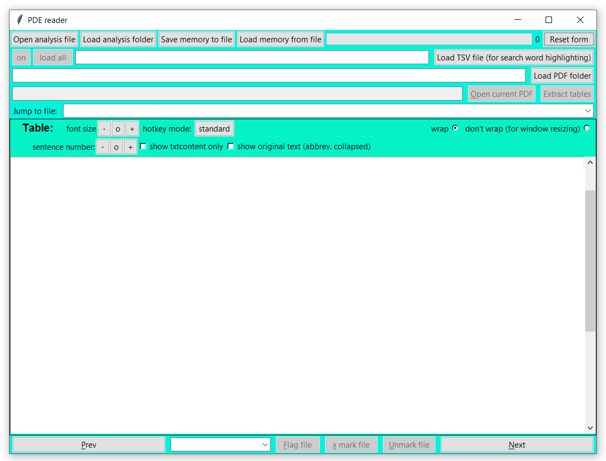

`PDE_reader_i()` user interface on Microsoft Windows

 

1.  Run

<!-- -->

    library("PDE")
    PDE_reader_i()

1.  This should open a user interface, e.g., a window with feather icon
    in task bar.

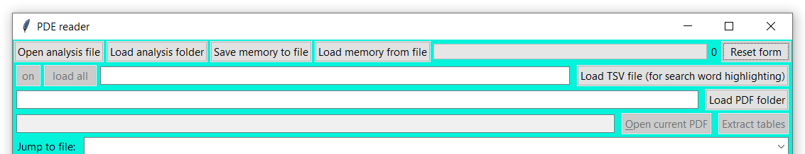

`PDE_reader_i()` user interface - Load and open

 

1.  Load either a sentence analysis file or a folder with such files.
    The table shown in the center of the application is writable,
    editable and copyable, but changes will not be saved in the original
    file.  
    **NOTE: Analysis files refer to the files created by the PDE
    analyzer which contain “txt+-” in their name.**

    -   **Open analysis file**: Loading a single file will be quick and
        open the selected file in the reader. The file will also be
        added into the memory of the program until the program is
        closed. All other analysis files in the folder will be shown
        under “Jump to file:”.

    -   **Load analysis folder**: This will load all analysis files into
        the memory. For larger number of files, the progress bar on the
        top right will indicate the progress and indicate when the
        program can be accessed again. All files will be shown under
        “Jump to file:” and are quickly accessible, since they are in
        the memory.

2.  **Save memory to file**: The table and all tables that are currently
    displayed by the `PDE_reader_i()` during a session are saved into
    the memory of the program, enabling quick browsing through the
    tables with minimal loading time. Since the memory is reset anytime
    the program closes, the memory can be saved into a .RData file to
    prevent long loading times during later sessions.

3.  **Load memory from file**: Tables that were saved into the memory
    during earlier sessions can be loaded into the program from a
    corresponding .RData file.

4.  **Reset form**: The form and memory can be emptied with this button.

5.  **On/off**: This button enables switching between search word
    highlighting in case an appropriate TSV file is loaded (see **Load
    TSV file**). The button shows the current state of highlighting. The
    search word is found between █▶ and ◄█.

6.  **Load all**: The options **Load TSV file** and **Open analysis
    file** will only save the already displayed tables into the memory.
    To shorten loading times all analysis files in the current folder as
    well as their search word highlighted tables can be loaded into the
    memory with this button. This will load the tables with and without
    highlighting to allow rapid switching between the two. The green bar
    on the top right will display the progress.  
    **NOTE: In the case of high numbers of search words or analysis
    files this step can take a long time (e.g., 1500 analysis files +
    400 search words -&gt; 1.5 h). For this reason, saving the memory to
    a file once the files are loaded is recommended.**

7.  **Load TSV file**: Search words used for the analysis can be
    highlighted by loading the TSV parameter file used for the analysis.
    The highlighting can be turned off and on and search words are
    indicated in the table by █▶-`[search word]`-◄█.

8.  **Load PDF folder**: The analyzed PDF file can be loaded into the
    reader by loading the PDF folder with the corresponding files. The
    PDF file name will show to the left of the **Open current pdf**
    button below the load PDF folder row.

9.  **Open current pdf**: If a PDF file analyzed is detected in the PDF
    folder, pressing the button will open the PDF file in the system
    default PDF viewer.

10. **Extract tables**: This button allows the user to extract all
    tables from the current PDF file converting them into an Excel
    compatible format. Extraction parameters such as pixel deviation
    between columns (see `PDE_analyzer_i()` §3) are derived from the TSV
    file chosen for search word highlighting. The extraction of the
    tables usually takes a few seconds, and, after extraction, the
    destination folder (same as analysis file folder) of the extracted
    tables is opened.  
    **NOTE: The table extraction only works when PDF file and TSV files
    are available.**

11. **Jump to file**: This check box lists all analysis files in the
    chosen folder. When choosing a file from the list, the reader jumps
    to the respective table. This will happen with a slight delay if the
    files are not already loaded in the memory (see **Open analysis
    file**, **Load analysis folder**).

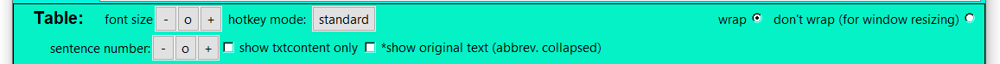

`PDE_reader_i()` user interface - Table display

 

1.  **Font size**: The font size of all buttons, the labels and the
    table can be increased (**+**), decreased (**-**) or reset (**o**)
    located above the table.

2.  **hotkey mode**: There are 4 different hotkey modes, which allow the
    use of the buttons of a keyboard to quickly navigate through files.
    The hotkeys for each mode are as follows and can be changed by
    clicking on the botton on the right of the hotkey mode label:

<table>
<thead>
<tr class="header">
<th></th>
<th><strong>standard</strong></th>
<th><strong>one hand</strong></th>
<th><strong>one hand &amp; standard (oh+std)</strong></th>
<th><strong>no hotkey</strong></th>
</tr>
</thead>
<tbody>
<tr class="odd">
<td><strong>previous</strong></td>
<td>n or left arrow</td>
<td>j or a</td>
<td>j or a or n or left arrow</td>
<td>none</td>
</tr>
<tr class="even">
<td><strong>next</strong></td>
<td>p or right arrow</td>
<td>l or d</td>
<td>l or d or p or right arrow</td>
<td>none</td>
</tr>
<tr class="odd">
<td><strong>scroll table down</strong></td>
<td>down arrow</td>
<td>k or s</td>
<td>k or s or down arrow</td>
<td>none</td>
</tr>
<tr class="even">
<td><strong>scroll table up</strong></td>
<td>up arrow</td>
<td>i or s</td>
<td>i or s or up arrow</td>
<td>none</td>
</tr>
<tr class="odd">
<td><strong>flag file</strong></td>
<td>f</td>
<td>h or f</td>
<td>h or f</td>
<td>none</td>
</tr>
<tr class="even">
<td><strong>x mark file</strong></td>
<td>x</td>
<td>space</td>
<td>space or x</td>
<td>none</td>
</tr>
<tr class="odd">
<td><strong>unmark file</strong></td>
<td>u</td>
<td>u or e</td>
<td>u or e</td>
<td>none</td>
</tr>
<tr class="even">
<td><strong>open pdf</strong></td>
<td>o</td>
<td>o or q</td>
<td>o or q</td>
<td>none</td>
</tr>
</tbody>
</table>

1.  **Wrap**: When choosing this option, located on the right above the
    table, the text in the central table will have line breaks to be
    fully visible. This will prevent in some occasions the resizing of
    the window. To prevent this issue, choose “don’t wrap” while
    resizing and activate resizing afterwards, again. In case the table
    does not fit vertically inside the window, either the scroll bar can
    be used to show different rows of the table.

2.  **Sentence number**: If sentences surrounding the sentence with the
    search word were extracted by the `PDE_analyzer_i()` (i.e.,
    `context > 0`), the number of sentences displayed can be decreased
    (**-**), increased (**+**), or reset (**o**). When changing this
    setting, the sentences with the search word will always be
    displayed.

3.  **Show txtcontent only**: Generally, the analysis file includes
    information about the page and paragraphs where the sentences were
    extracted from. When selecting **Show txtcontent only**, only the
    sentences without the positional information is displayed.

4.  **Show original text (abbreviations collapsed)**: If the analysis
    abbreviations were replaced in the format ABBREVIATION -&gt;
    ABBREVIATION (search word)$\* (i.e., eval.abbrev = TRUE), then the
    original text can be restored by using this setting. This setting
    will also lead to the disappearance of some search words, as only
    the abbreviations remain.

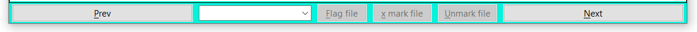

`PDE_reader_i()` user interface - Browse and mark

 

1.  **Prev** and **Next**: Using these buttons the user can quickly
    browse through the different tables in the analysis folder.

2.  **Flag file**: Using this button can either **Mark analysis file
    only**, **Mark PDF only** or **Mark analysis file & PDF**. The
    reader will rename the corresponding file adding a “!\_” to the
    beginning of its name.

3.  **X mark file**: Using this button can either **Mark analysis file
    only**, **Mark PDF only** or **Mark analysis file & PDF**. The
    reader will rename the corresponding file adding a “x\_” to the
    beginning of its name.

4.  **Unmark file**: Using this button can either **Unmark analysis file
    only**, **Unmark PDF only** or **Unmark analysis file & PDF**. The
    reader will remove and existing “!\_” or “x\_” at the beginning of
    the file name.  
    **NOTE: Flagging and marking changes filenames but can be reversed
    in the program at any time.**

------------------------------------------------------------------------

Troubleshoot
------------

This section covers common errors we encountered when testing the
package including their solution.

### Error when starting interactive user interface on Mac (failed to allocate tcl font)

#### Step of error occurence:

`PDE_analyzer_i()`  
or  
`PDE_reader_i()`

#### Error:

    Error in structure(.External(.C_dotTclObjv, objv), class = "tclObj") :
    [tcl] failed to allocate font due to internal system font engine problem.

#### Solution:

1.  Press the Ctrl+Alt+T key to open the terminal.  
2.  Type the following command:
    `echo 'export PATH=$PATH:/path/to/pdftotext' >> ~/.bashrc`
3.  Close the terminal.  
4.  Press the Ctrl+Alt+T key to open the terminal, again.  
5.  Close the terminal, again.

------------------------------------------------------------------------

Example
-------

### Process Methotrexate articles with the PDE\_analyzer\_i()

1.  Run

<!-- -->

    library("PDE")
    PDE_analyzer_i()

1.  This should open a user interface, e.g., a window with feather icon
    in task bar.

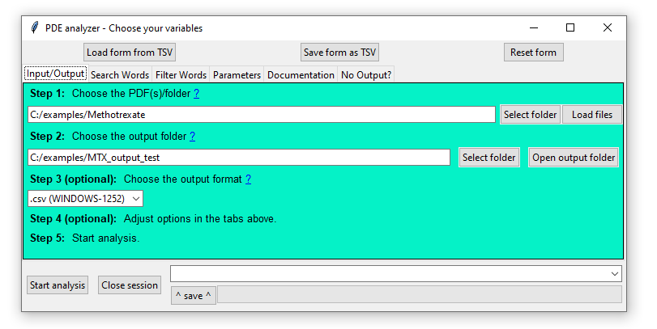

`PDE_analyzer_i()` user interface

 

All files for example can be found in the installation folder
`examples`. The folder can be located by running the following code in
the R console:

    PDE::PDE_path()

#### Alternative to step-by-step selection: Load form from TSV

1.  **Load form from TSV**: Alternatively, all parameters can be loaded
    from the file with the name `PDE_parameters_v1.0_all_files+-0.tsv`
    found in the subfolder `examples/tsvs/`. Then continue with **Start
    the PDE analyzer**.

#### Step-by-step selection of the parameters

##### Input/Output:

`PDE_analyzer_i()` user interface - Input/Output

 

1.  **Open PDF folder**: Open the folder with the pdfs. For the this
    example, 3 PDF files downloaded from PubMed using
    `(methotrexate) NOT Review[Publication Type]` as well as 1 erroneous
    (`99999999_x.pdf`) and 1 empty file (`00000000_x.pdf`) are in the
    following folder:

<!-- -->

    examples/Methotrexate/

The file names indicate the PMIDs. In addition, negative controls are
marked with an “*x" and the files which include tables with the search
words are marked with an "*!” (this naming system is specifically chosen
for the example, but generally analyses files are not restricted to any
particular naming system other than no two files should have the same
name).  
or  
**Load PDF files**: Select the 5 PDF files to analyze (use Ctrl and/or
Shift to select multiple).

    examples/Methotrexate/29973177_!.pdf
    examples/Methotrexate/31083238_!.pdf
    examples/Methotrexate/31261533_x.pdf
    examples/Methotrexate/00000000_x.pdf
    examples/Methotrexate/99999999_x.pdf

1.  **Choose what to extract**: For the example, the analyzer will
    extract sentences and tables with the keywords. Accordingly, the
    option `both` should be chosen.

2.  **Open output folder**: The files created by the `PDE_analyzer_i()`
    should be identical to the files found in `examples/MTX_output`. Any
    output folder can be chosen for the example analysis but the
    following folder is recommended for direct comparison:  

<!-- -->

    examples/MTX_output_test

1.  **Choose output format**: For the example analysis, the tab
    separated values format was chosen:

<!-- -->

    .tsv

##### Parameters:

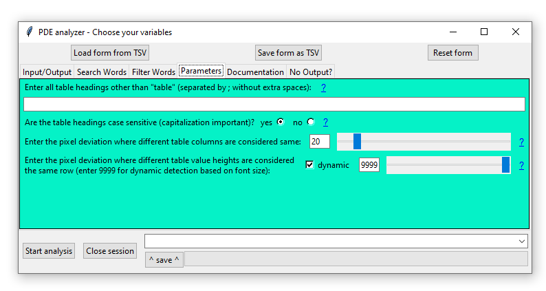

`PDE_analyzer_i()` user interface - Parameters

 

1.  **Enter table headings**: For most scientific papers, this option is
    not necessary to be populated as is of greater use in extracting
    tables from non-journal articles. Accordingly, for the example the
    field was left empty.

<!-- -->

    [blank] 

1.  **Table heading case sensitive**: Irrelevant, as table heading was
    left blank.

2.  **Pixel deviation**: Kept at standard value of 20. This ensured that
    despite the indentation each cell value still gets sorted in the
    correct column instead of creating additional columns.

<!-- -->

    20 

1.  **Filter words?**: For this analysis, filter words were used to only
    analyze articles with case-control data.

<!-- -->

    yes 

1.  **Filter words**: These words should be found at a high frequency in
    case-control papers. The filter words are only separated by
    semicolons (no spaces for separation).

<!-- -->

    cohort;case-control;group;study population;study participants 

1.  **Filter words case sensitive**: Since it does not matter if a word
    is found capitalized at the beginning of a sentence, in a heading or
    within a sentence the search is not case-sensitive.

<!-- -->

    no

1.  **Filter word times**: Kept at standard value of 20. Negative
    controls included an average of 2.4 times the filter words (despite
    showing a higher number of filter words `31261533_x.pdf` did not
    include controls classifying it as a case-control study). The
    case-control papers displayed on average 55 times the filter words.

<!-- -->

    20

1.  **Search words?**: The search words were used to extract all
    Methotrexate relevant information.

<!-- -->

    yes

1.  **Search words**: The list of search words includes all aliases and
    the most common and distinctive abbreviation of Methotrexate.
    Parentheses and a vertical line were used to account for positioning
    at the beginning of the sentence since abbreviations are commonly
    case-sensitive and only found in capital letters. The search words
    are only separated by semicolons (no spaces for separation).

<!-- -->

    (M|m)ethotrexate;(T|t)rexal;(R|r)heumatrex;(O|o)trexup

1.  **Search words case sensitive**: As explained above, the search
    words are case-sentive due to an abbreviation being included.

<!-- -->

    yes

1.  **Number of sentences before and after**: For simplicity reasons,
    only the sentences with the search words were extracted.  

<!-- -->

    0

1.  **Evaluate abbreviations?**: Abbreviations of Methotrexate such as
    MTX should also be detected in the document.

<!-- -->

    yes

##### Documentation/Debugging:

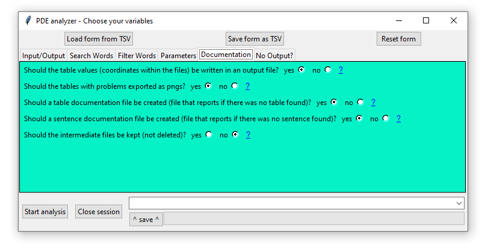

`PDE_analyzer_i()` user interface - Documentation/Debugging

 

1.  **Table values in file**: This option is commonly not necessary to
    be selected. Nonetheless, it helps to identify if the PDE detects
    the tables and, if yes, if they are exported. When comparing the
    files starting with the PDF file name followed by “htmltablelines”,
    “txttablelines”, “keeplayouttablelines”, it can be observed that all
    detected tables contained at least one of the search words.

<!-- -->

    yes

1.  **Export tables with problems**: This is recommended to capture all
    tables, even if the program cannot detect the table content. This
    applies especially, for older articles with scanned tables.

<!-- -->

    yes

1.  **Table documentation files?**: For completeness of the example,
    “yes” was chosen. Generally, it is safe to assume that papers
    without a file being created were sorted out due to a lack of search
    words or filter words.

<!-- -->

    yes

1.  **Sentence documentation file?**: For reasoning see **Table
    documentation files?**. Again, for completeness of the example,
    “yes” was chosen. This option does not influence the creation of the
    `[id]_is_secured.txt` file in the secured folder.

<!-- -->

    yes

1.  **Delete intermediate files**: This option is primarly for
    debugging. Having access to the .txt and .html files will allow the
    identification of undetected tables/sentences or conversion issues.

<!-- -->

    yes

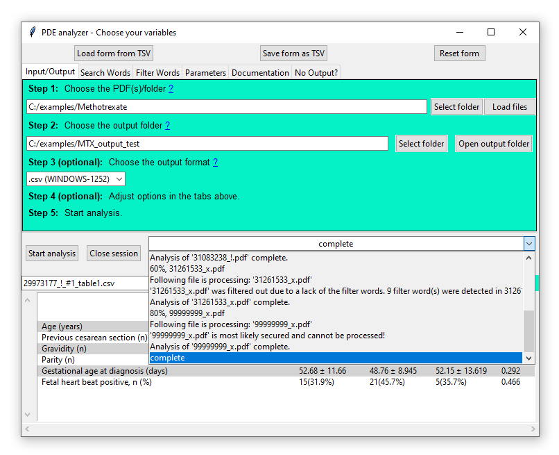

`PDE_analyzer_i()` user interface - Start analysis

 

#### Start analysis

Start analysis: During the analysis, the progress bar indicates the
number of files analyzed, while the drop down menu and the R console
display status updates:

    Following file is processing: '00000000_x.pdf'
    00000000_x.pdf has no readable content
    Analysis of '00000000_x.pdf' complete.
    Following file is processing: '29973177_!.pdf'
    58 filter word(s) were detected in 29973177_!.pdf.
    4 table(s) with search words found in '29973177_!.pdf'.
    43 sentences with search words were found in '29973177_!.pdf'.
    Analysis of '29973177_!.pdf' complete.
    Following file is processing: '31261533_x.pdf'
    '31261533_x.pdf' was filtered out due to a lack of the filter words. 9 filter word(s) were detected
    Analysis of '31261533_x.pdf' complete.
    Following file is processing: '99999999_x.pdf'
    99999999_x is most likely secured and cannot be processed!
    Analysis of '99999999_x.pdf' complete.
    Analyses are complete.

As mentioned above, the resulting files should be identical to the files
found in `examples/MTX_output/.`

------------------------------------------------------------------------

### Visualize extracted Methotrexate data with the PDE\_reader\_i()

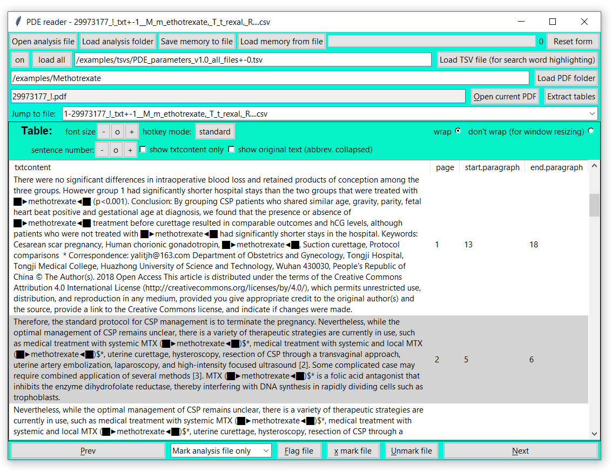

`PDE_reader_i()` user interface

 

1.  To open the PDE\_reader\_i() run:

<!-- -->

    library("PDE")
    PDE_reader_i()

`PDE_reader_i()` user interface in Windows

  2. This should open a user interface, e.g., a window with feather
icon in task bar.

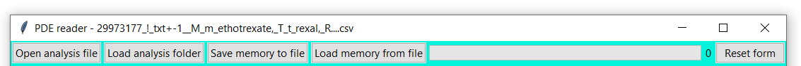

`PDE_reader_i()` user interface - Load and open

  3. Load either a sentence analysis file such as
`31083238_!_txt+-0__M_m_ethotrexate,_T_t_rexal,_R....csv` or the whole
folder folder with such files, e.g., `examples/MTX_output`.  
**NOTE: All files with “txt+-” in their name can be browsed.**

-   **Open analysis file**: Loading a single file will be quick and will
    open the selected file in the reader.

-   **Load analysis folder**: This will load all analysis files into the
    memory. For larger number of files, the progress bar on the top
    right will indicate the progress and indicate when the program can
    be accessed again. All files will be shown under Jump to file and
    are quickly accessible, since they are in the memory.

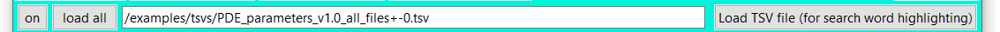

`PDE_reader_i()` user interface - Load TSV for highlighting

 

1.  **Load TSV file**: Open the TSV file such as
    `PDE_parameters_v1.0_all_files+-0.tsv` in the folder
    `examples/tsvs/` to highlight the search words in following way:
    █▶-`[search word]`-◄█.

2.  **On/off**: Search word highlighting can be turned off and on using
    this button. This will load the tables with and without highlighting
    to allow rapid switching between the two.

3.  **Load all**: To speed up browsing, press this button. It might take
    a second to load all analysis files.

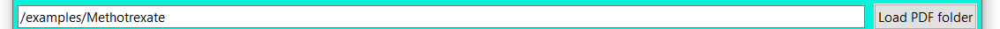

`PDE_reader_i()` user interface - Load PDF folder

 

1.  **Load PDF folder**: To enable the **Open current pdf** as well as
    **Extract tables** button load the PDF folder into the reader,
    i.e. `examples/Methotrexate`.

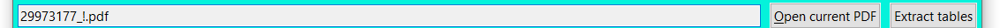

`PDE_reader_i()` user interface - Open PDF or extract table

 

1.  The name of the current PDF file will show to the left of the **Open
    current pdf** button below the load PDF folder row.

2.  **Open current PDF**: To quickly open the PDF file in the default
    PDF viewer, click this button.

3.  **Extract tables**: For the example we extracted all tables from the
    detected PDF (since each table had either the word `Methotrexate` or
    `MTX` in it). You can still press the button though to watch the
    program extract all tables into a new subfolder names
    `extracted_tables` which can be found in the PDF folder. **NOTE: The
    table extraction only works when PDF file and TSV files are
    available.**

`PDE_reader_i()` user interface - Jump to files

 

1.  **Jump to file**: Instead of going from one file to the next you can
    also quickly jump to a file through the drop down menu.

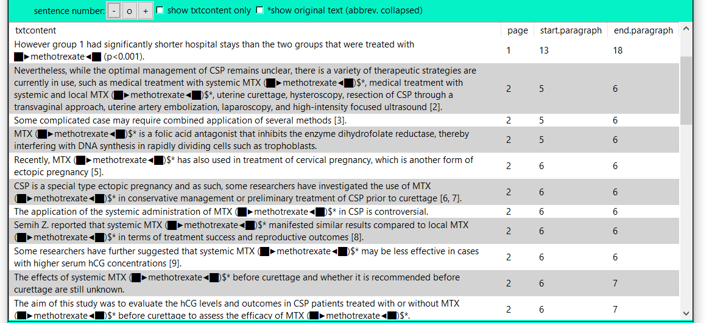

`PDE_reader_i()` user interface - Table display with one sentence before
and after less

 

1.  **Sentence number**: When choosing a analysis file with `txt+-1` or
    higher the number of senten displayed can be decreased (**-**),
    increased (**+**), or reset (**o**). When changing this setting, the
    sentences with the search word will always be displayed.

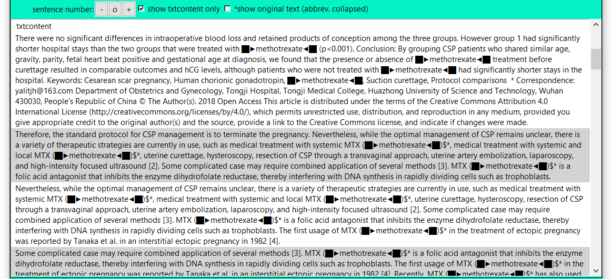

`PDE_reader_i()` user interface - Table display with text content only

 

1.  **Show txtcontent only**: When selecting **Show txtcontent only**,
    only the sentences/text without the positional information is
    displayed.

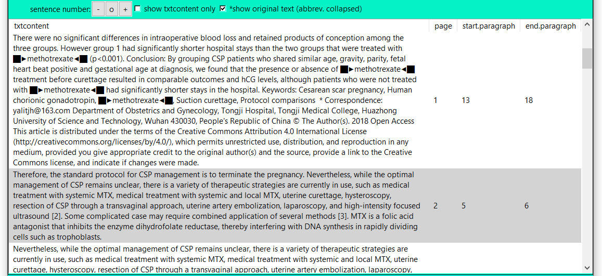

`PDE_reader_i()` user interface - Table display without abbreviations
replaced

 

1.  **Show original text (abbreviations collapsed)**: Choosing this
    setting will restore the orginial sentences by replacing
    `ABBREVIATION (search word)$*` with `ABBREVIATION`, e.g.,
    `MTX (Methotrexate)$*` with `MTX`.

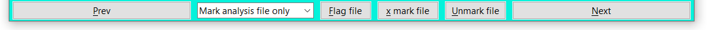

`PDE_reader_i()` user interface - Browse and mark

 

1.  **Prev** and **Next**: Using these buttons the user can quickly
    browse through the different tables in the analysis folder.

2.  **Flag file**: Using this button can either **Mark analysis file
    only**, **Mark PDF only** or **Mark analysis file & pdf**. The
    reader will rename the corresponding file adding a “!\_” to the
    beginning of its name. This is how `31083238_!.pdf` was generated.
    **NOTE: Make sure you have selected the file type (analysis file +-
    PDF file) which you want to mark.**

3.  **X mark file**: Using this button can either **Mark analysis file
    only**, **Mark PDF only** or **Mark analysis file & pdf**. The
    reader will rename the corresponding file adding a “x\_” to the
    beginning of its name. You can try this option for the files like
    `31083238_!.pdf`.

4.  **Unmark file**: Using this button can either **Unmark analysis file
    only**, **Unmark PDF only** or **Unmark analysis file & pdf**. The
    reader will remove and existing “!\_” or “x\_” at the beginning of
    the file name. You can take off the mark from `31083238_!.pdf`.
    **NOTE: Flagging and marking changes filenames but can be reversed
    in the program at any time.**

You are at the end of this small example tutorial and should be a pro in
literature search now!

`PDE_reader_i()` user interface

 
